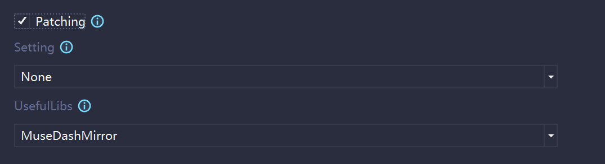
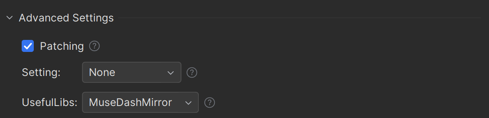

# MuseDash.Mod.Template

[](https://www.nuget.org/packages/MuseDash.Mod.Template)

**A template for making Muse Dash Mods**

## Pre-requisites

* [Muse Dash](https://store.steampowered.com/app/774171/Muse_Dash/) with [MelonLoader 0.6.1](https://github.com/LavaGang/MelonLoader)
* [.Net SDK 6.0](https://dotnet.microsoft.com/en-us/download/dotnet/6.0)
* Any C# IDE ([Visual Studio](https://visualstudio.microsoft.com), [Rider](https://www.jetbrains.com/rider), etc.)

## Getting Started (Windows Only)

* Download [SetPath.cmd](SetPath.cmd) from this repository and run it as administrator, follow the instructions to set Muse Dash path into your
  computer's environment variable.
* Open command prompt or powershell, run

```shell
dotnet new install MuseDash.Mod.Template
````

This will install the template on your computer.

## Usage

* If you are using Visual Studio, you should be able to find the template in `Create a new project -> MuseDash Mod`

  Then you can create a new project with the following options:
  

* If you are using Rider, you should be able to find the template in `New Solution -> Custom Templates -> MuseDash Mod`

  Then you can create a new project with the following advanced settings:
  

### Parameters

* `--Patching`: Whether to generate a patching class for the mod. (Defaults to true)
* `--Setting`: Options for generating a setting class for the mod. (Defaults to None)
    * `None`: Do not generate a setting class
    * `MelonLoader`: Use MelonPreferences for setting
    * `Tomlet`: Use Tomlet directly for setting, this will also generate a `Data` class for setting
* `--UsefulLibs`: Options for including useful libraries for the mod. (Defaults to MuseDashMirror)
    * [`MuseDashMirror`](https://github.com/MDMods/MuseDashMirror): Offers more smooth and efficient modding experience for Muse Dash.
    * [`ILRepack`](https://github.com/ravibpatel/ILRepack.Lib.MSBuild.Task): Able to merge dependencies and mod into a single dll file.
    * [`UniTask`](https://github.com/Cysharp/UniTask): Provides an efficient allocation free async/await integration for Unity.
    * [`ZString`](https://github.com/Cysharp/ZString): Zero Allocation StringBuilder for better performance.

## Update Template

Run the following command

```shell
dotnet new update
```

## Build From Source

* Clone the repository to your computer
* Open command prompt or powershell in that folder, run

```shell
dotnet build
````

* Or you can use your IDE to open the `MuseDash.Mod.Template.sln` solution file and build the solution

> [!NOTE]
> If you saw errors during the build about `Error CS1031`, it's normal, and you can ignore it. The nuget package file should still be generated.

* Then you can find the nuget package in `bin/MuseDash.Mod.Template.{version}.nupkg`
* Open command prompt or powershell in `bin` folder, run

```shell
dotnet new install MuseDash.Mod.Template.{version}.nupkg
```

> [!IMPORTANT]
> If you have installed the template before, you should uninstall it first by running `dotnet new uninstall MuseDash.Mod.Template` before installing the built
> version.